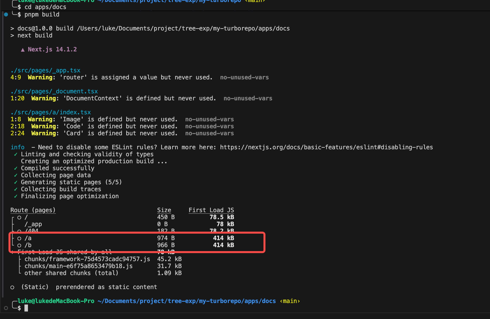
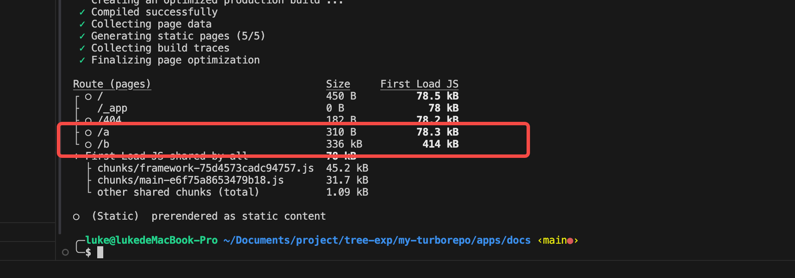

# Tree shaking

1. 在 apps/docs 中执行 pnpm build

   

    其中 page a 和 b 大小都是 414k

2. 在 apps/docs/next.config.js 中解除注释
   ```
     // experimental: {
     //   optimizePackageImports: [
     //    '@repo/ui'
     //   ],
     // },
   ```
3. 再次 build 后 a 页面变为 78k
   
